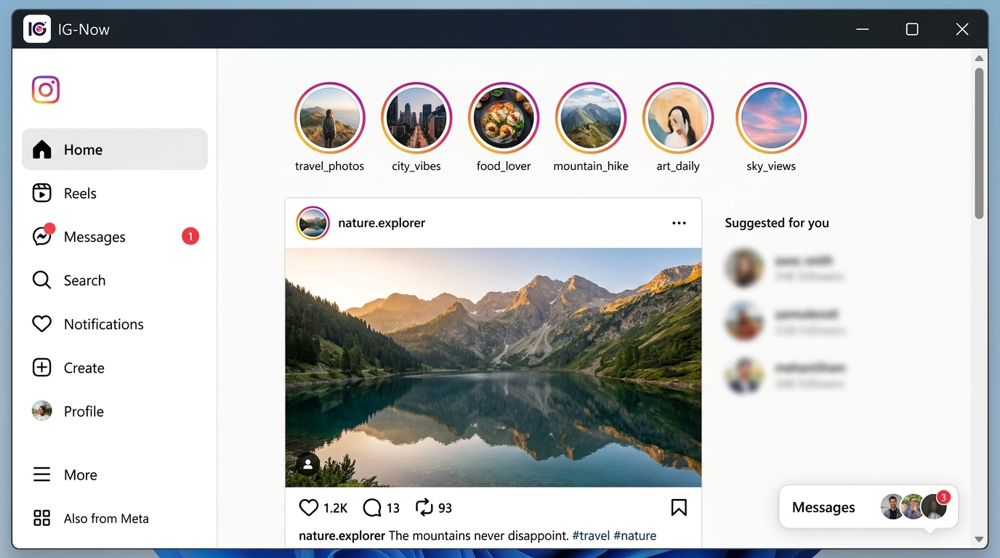
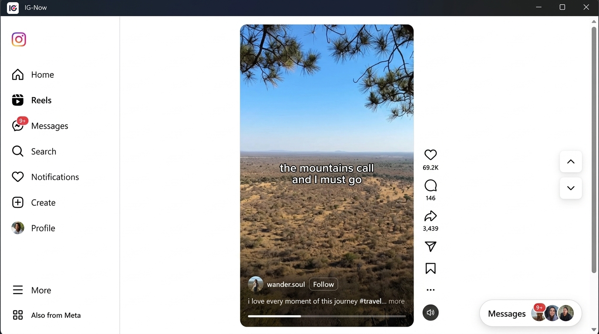
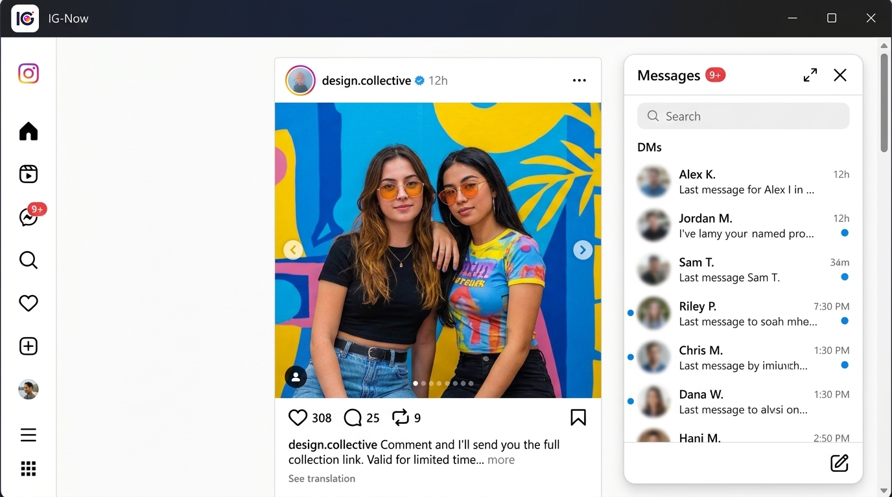

<p align="center">
  
</p>

<h1 align="center">IG-Now</h1>

<p align="center">
  <strong>A high-performance, cross-platform desktop client for <a href="https://instagram.com">Instagram</a></strong><br/>
  Built with <a href="https://tauri.app">Tauri v2</a> + Rust · WebView2 · WebKit
</p>

<p align="center">
  <strong>🎉 IG-NOW RELEASE: v1.0.0 IS NOW LIVE! 🎉</strong><br/>
  <em>After meticulous development, the latest official build of IG-Now is ready for deployment.</em>
</p>

<p align="center">
  
  
  
  
  
  
  <a href="https://github.com/benedictusrey"></a>
</p>

---

## 🚀 Welcome to the Future of Instagram on Desktop

**IG-Now** isn't just a wrapper — it's a meticulously engineered native desktop client that supercharges your Instagram experience. Designed for speed, aesthetics, and power users, IG-Now seamlessly bridges the gap between the Instagram web and your operating system.

> IG-Now is not affiliated with, sponsored by, or maintained by Instagram or Meta Platforms, Inc. Use Instagram and any downloader service according to their terms, local law, and the rights attached to the media.

### 🌟 Why Choose IG-Now?

#### 1. Unrivaled Performance & Efficiency
Say goodbye to the heavy memory usage of standard web browsers. Built entirely on Rust and Tauri v2, IG-Now is designed to be incredibly lightweight. It actively manages background resources, meaning your computer stays blazing fast and responsive — even during endless scrolling sessions. Your Instagram feed, delivered at native speed.

<p align="center">
  
</p>

#### 2. Immersive Reels & Distraction-Free Aesthetics
IG-Now strips away the browser clutter to give you a pure, edge-to-edge experience with native styling. Reels are optimized to play smoothly as you scroll — pausing instantly when out of view to protect your RAM. Keyboard navigation (`↑` / `↓`) lets you fly through content without touching your mouse. The result: a cinematic, browser-free Reels session.

<p align="center">
  
</p>

#### 3. Deep OS Integration & Floating Messages Panel
Why open a browser tab when you can command everything from your taskbar? IG-Now lives inside your OS like a true native application. The floating Messages panel puts your DMs front-and-center while you browse your feed — no switching, no context loss. Right-click images to save them natively to `Downloads\IG-Now`, or copy post links directly to Cobalt for video downloads.

<p align="center">
  
</p>

---

## Quick Start

### Use the Release Builds

We provide cross-platform builds for **Windows, macOS, and Linux** through GitHub Actions. Head to the [Releases](https://github.com/benedictusrey/IG-Now/releases) page to download the latest version for your system.

| Platform | Installer | Notes |
|---|---|---|
| **Windows 10/11** | `.exe` (NSIS) or `.msi` (WiX) | Requires Edge WebView2 Runtime |
| **macOS** | `.dmg` (Apple Silicon + Intel) | Requires macOS 10.15+ |
| **Linux** | `.AppImage` / `.deb` / `.rpm` | Requires libwebkit2gtk-4.1 |

### Windows

1. Install the [Microsoft Edge WebView2 Runtime](https://developer.microsoft.com/en-us/microsoft-edge/webview2/) if not already present.
2. Run `IG-Now_1.0.0_x64-setup.exe` (or the `.msi` variant).
3. Sign in through the official Instagram page shown inside the app.
4. Reopen **IG-Now** later to resume your existing session automatically.
5. Use the system-tray icon for navigation, Cobalt hand-off, and app controls.

The login session is stored by the WebView2 application data folder on the local machine. IG-Now does not implement a secondary profile manager — Instagram's own account-switching UI handles multiple signed-in accounts.

### macOS

1. Open the downloaded `.dmg` and drag **IG-Now** to your Applications folder.
2. On first launch, right-click and choose **Open** to bypass Gatekeeper (unsigned build).
3. Sign in through the Instagram page that appears inside the app.

### Linux

1. Make the AppImage executable: `chmod +x IG-Now_1.0.0_amd64.AppImage`
2. Run it: `./IG-Now_1.0.0_amd64.AppImage`
3. Sign in through the Instagram page inside the app.

> **Tip:** On some Linux distributions you may need `libwebkit2gtk-4.1` installed: `sudo apt install libwebkit2gtk-4.1-dev`

---

## Media Controls

| Context | Default target | Seeking | Audio & native controls |
|---|---:|---|---|
| Search card while hovered | 20% | Click or drag the white seek line | Autoplays muted; Instagram's mute UI remains the authority |
| Home or Reels media after a user gesture | 50% | `←` / `→` — 5 seconds | Unmuted after the gesture; Instagram fullscreen and mute controls remain available |
| Standalone Reel after opening a card | 50% | `←` / `→` — 5 seconds | Unmuted after opening; `Escape` returns to the previous state |

The IG-Now overlay does not add a duplicate mute icon. Its empty areas are pointer-transparent so Instagram's own mute and fullscreen elements receive clicks directly. Only the IG-Now play button and Search-card seek bar own their small interaction regions.

---

## Saving & Opening Media

### Images

Right-click any image and choose the save action. IG-Now creates the folder below when needed and writes the image there:

```text
%USERPROFILE%\Downloads\IG-Now
```

*(On macOS and Linux, the equivalent user Downloads folder is used.)*

### Videos

Right-click a video and choose **Copy link and open Cobalt**. IG-Now copies the exact Instagram post URL, prepares the `Downloads\IG-Now` directory, and opens:

```text
https://cobalt.tools/?u=<encoded-post-url>
```

Choose the video format and save from Cobalt into the prepared `Downloads\IG-Now` folder. Cobalt is an external service; it may require an authorized instance and controls the final download response. IG-Now does not bypass Instagram access controls.

### Default Browser

Use the media menu's **Open post in default browser** action, or right-click any Instagram link and choose **Open link in default browser**. The native Tauri shell validates the destination as an HTTP(S) URL before opening.

---

## Requirements

- **Windows** 10/11 (64-bit) with [Edge WebView2 Runtime](https://developer.microsoft.com/en-us/microsoft-edge/webview2/), **macOS** 10.15+, or **Linux** (x64/arm64).
- Internet access to load Instagram and any external Cobalt page.
- A signed-in Instagram session for account-specific content.

---

## Build from Source

Install [Node.js](https://nodejs.org/), [Rust](https://rustup.rs/), and the [Tauri 2 CLI](https://tauri.app/start/), then run the checks from the repository root:

```sh
node --check frontend/instagram-tools.js

cd src-tauri
cargo fmt --all -- --check
cargo check
cargo tauri build --ci
```

To keep build products outside the source tree on Windows:

```powershell
$env:CARGO_TARGET_DIR = 'C:\path\to\ig-now-build-target'
cargo tauri build --ci --no-sign
```

---

## Privacy & Security Notes

IG-Now does not add analytics or a remote account database. Instagram page traffic is handled by Instagram's service natively inside WebView2/WebKit. The local session data stays on the local computer. The native bridge exposes only the narrow actions required for: opening safe external URLs, saving image bytes, preparing the download folder, and handing off a media URL that Instagram has already exposed.

Treat the following as private:

- WebView session data and your signed-in account state.
- Downloaded media in `Downloads\IG-Now`.
- Any copied Instagram post URL.
- Cobalt results and any third-party downloader response.

The README showcase images are synthetic mockups and contain no actual user account data.

---

## Verification Checklist (Release Review)

The repository checks validate JavaScript syntax, Rust formatting, Rust dependency compilation, and package generation. They do not replace a manual signed-in WebView check because Instagram can update its DOM and media delivery at any time. For a release review, verify in this order:

1. Open Home, Reels, and Search — confirm no blank or frozen views.
2. Hover a Search card and drag its white seek line.
3. Open a card, confirm 50% unmuted playback, and test Instagram's own mute/fullscreen UI.
4. Test `←` / `→` seeking and `Escape` on a standalone Reel.
5. Test Ctrl-click, right-click, default-browser routing, and the Cobalt hand-off.
6. Confirm image output appears in `Downloads\IG-Now`.

---

## Author

IG-Now is crafted and maintained by  
[@benedictusrey](https://github.com/benedictusrey)

The project is intentionally independent from Instagram and Meta. Contributions and reproducible bug reports are welcome — provided they do not include credentials, private session data, or private downloaded media.
